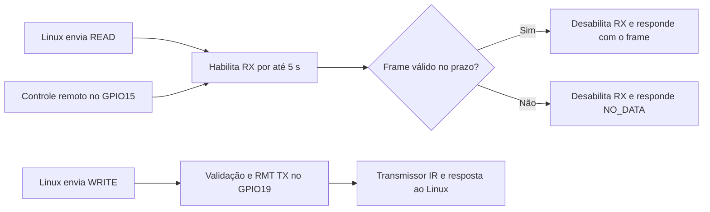

# Firmware de infravermelho RAW e protocolo v1

Este firmware permite capturar e retransmitir sinais infravermelhos RAW pelo
ESP32. A captura começa **somente quando o Linux envia READ**. Cada requisição
abre uma janela de **5 segundos** para obter um frame completo e válido. Sem
um frame válido no prazo, retorna `NO_DATA`; em ambos os casos, RX é desabilitado
antes da resposta. Não há captura automática ao iniciar nem reutilização de
frames anteriores. WRITE transmite o código fornecido pelo Linux.

A comunicação binária usa inteiros **little-endian**: o byte menos significativo
é enviado primeiro. O formato transmitido independe de estruturas C, padding,
alinhamento, bitfields e tipos internos do ESP-IDF. Não há decodificação de NEC,
Samsung, LG ou outros protocolos de controles remotos.

## Como o firmware funciona



Após validar um READ, a task de protocolo chama `ir_rx_capture()` e espera.
A task RX habilita o RMT, inicia a medição e controla o prazo. O callback de
interrupção registra o instante de conclusão e avisa a task por uma fila.
A task converte os níveis elétricos em MARK/SPACE, valida o resultado e encerra
a recepção após o primeiro frame válido. Frames vazios, inválidos ou grandes
demais são descartados, e a recepção é rearmada apenas enquanto resta tempo.
Ruído não reinicia o prazo. Um frame deve terminar dentro da janela, incluindo
a detecção do fim pelo intervalo de ociosidade do RMT.

Ao expirar o prazo, uma captura ainda em andamento é descartada. O firmware
responde `NO_DATA` com payload vazio mesmo que uma requisição anterior tenha
tido sucesso. O instante registrado no callback determina se o frame chegou
a tempo, evitando depender do momento em que a task conseguiu processar o evento.
O tempo de resposta inclui o escalonamento da task e a transmissão pela UART.

WRITE valida e transmite o código recebido, respondendo após a conclusão.
PING apenas verifica a comunicação. RX permanece desabilitado durante WRITE,
PING e nos intervalos entre comandos. O protocolo processa uma requisição por vez.
O buffer do resultado fica em RAM somente para transferir os dados da operação;
READ nunca consulta um histórico ou uma captura armazenada. O cliente Python
pode salvar o payload em arquivo para retransmiti-lo depois com WRITE.

A implementação atual fornece a interface binária para uma futura integração
com um módulo de kernel Linux; o cliente Python permite testar essa interface.

## Arquivos e responsabilidades

Os arquivos `.h` declaram a interface de cada módulo; os `.c` implementam seu
comportamento. Na árvore abaixo, os pares foram agrupados para facilitar a leitura.

```text
ir-device/
├── CMakeLists.txt
├── main/
│   ├── main.c
│   ├── ir_rmt.c / ir_rmt.h
│   ├── ir_rx.c / ir_rx.h
│   ├── ir_tx.c / ir_tx.h
│   ├── ir_protocol.c / ir_protocol.h
│   ├── ir_transport_uart.c / ir_transport_uart.h
│   ├── ir_types.h
│   ├── Kconfig.projbuild
│   └── CMakeLists.txt
├── docs/
│   └── ir_protocol.md
├── tools/
│   └── ir_client.py
└── tests/
    ├── test_protocol.c
    ├── test_rx.c
    ├── run_host_tests.sh
    └── host_stubs/
```

| Arquivo ou módulo | Responsabilidade |
|---|---|
| [main.c](../main/main.c) | Executa a inicialização e inicia a aplicação. |
| [ir_rmt.c](../main/ir_rmt.c) / [ir_rmt.h](../main/ir_rmt.h) | Cria os canais RMT RX/TX e define GPIOs, resolução e memória do periférico. |
| [ir_rx.c](../main/ir_rx.c) / [ir_rx.h](../main/ir_rx.h) | Captura RAW sob demanda, normaliza a polaridade e desabilita RX ao concluir ou expirar o prazo. |
| [ir_tx.c](../main/ir_tx.c) / [ir_tx.h](../main/ir_tx.h) | Valida e transmite um código RAW, com portadora e encoder de cópia. |
| [ir_protocol.c](../main/ir_protocol.c) / [ir_protocol.h](../main/ir_protocol.h) | Implementa o parser, a serialização, o CRC, os comandos e a task de comunicação. |
| [ir_transport_uart.c](../main/ir_transport_uart.c) / [ir_transport_uart.h](../main/ir_transport_uart.h) | Configura o driver UART, lê/escreve bytes e trata erros seriais. |
| [ir_types.h](../main/ir_types.h) | Define os tipos próprios do projeto, os limites e a validação comum de códigos IR. |
| [Kconfig.projbuild](../main/Kconfig.projbuild) | Expõe a UART, o timeout de READ e o intervalo de fim de frame no `menuconfig`. |
| [main/CMakeLists.txt](../main/CMakeLists.txt) | Registra os fontes, as dependências e as opções `-Wall -Wextra -Werror`. |
| [CMakeLists.txt](../CMakeLists.txt) | Define o projeto ESP-IDF e habilita a compilação apenas das dependências necessárias. |
| [ir_client.py](../tools/ir_client.py) | Cliente serial para PING, leitura, gravação do payload em arquivo e retransmissão. |
| [test_protocol.c](../tests/test_protocol.c) | Testa o parser de produção usando substitutos dos serviços de hardware e do FreeRTOS. |
| [test_rx.c](../tests/test_rx.c) | Testa o módulo RX de produção com relógio, RMT e escalonamento simulados. |
| [run_host_tests.sh](../tests/run_host_tests.sh) / `host_stubs/` | Compilam e executam os testes no computador e fornecem suas interfaces simuladas. |

## Inicialização: o que cada init faz

O ponto de entrada é `app_main()`, executado pela task principal do ESP-IDF.
A ordem atual é:

```c
void app_main(void)
{
    ESP_ERROR_CHECK(ir_rmt_init());
    ESP_ERROR_CHECK(ir_rx_init());
    ESP_ERROR_CHECK(ir_tx_init());
    ESP_ERROR_CHECK(ir_transport_init());
    ESP_ERROR_CHECK(ir_protocol_init());
}
```

| Etapa | O que acontece |
|---:|---|
| 1. `ir_rmt_init()` | Cria os canais RX e TX com resolução de 1 MHz, memória reservada e DMA desabilitado. Ainda não inicia uma captura ou transmissão. |
| 2. `ir_rx_init()` | Cria fila, mutex e semáforo; registra o callback e cria a task `ir_rx`. O canal permanece desabilitado. |
| 3. `ir_tx_init()` | Cria o mutex e o encoder com `rmt_new_copy_encoder()`, e habilita o canal TX. A portadora é aplicada ao enviar cada código. |
| 4. `ir_transport_init()` | Valida porta/pinos, configura a UART binária e instala o driver com buffer de recepção e fila de eventos. |
| 5. `ir_protocol_init()` | Limpa o estado do parser e cria a task `ir_protocol`, que passa a receber e processar os comandos do Linux. |

Depois disso, `app_main()` retorna. As tasks de RX e protocolo continuam
executando; não é necessário um laço infinito em `main.c`.

Cada `init` deve ser chamado uma vez durante a inicialização. `ESP_ERROR_CHECK`
interrompe a execução em caso de erro, evitando que a aplicação prossiga com um
módulo sem inicialização. RMT e RX devem ser inicializados na mesma task, fixada
no mesmo núcleo, como ocorre em `app_main` com a configuração atual. A task RX
fica nesse núcleo para coordenar suas operações com a interrupção do RMT.

## Principais funções e tipos

### RMT e representação dos dados

| Função ou tipo | Uso |
|---|---|
| `ir_rmt_rx_channel()` / `ir_rmt_tx_channel()` | Retornam os identificadores internos dos canais para os módulos RX/TX. Esses identificadores não fazem parte do protocolo. |
| `ir_phase_t` | Uma fase com nível lógico e duração em ticks. |
| `ir_symbol_t` | Um símbolo formado por `phase0` e `phase1`. |
| `ir_code_t` | Código com quantidade de símbolos, flags, resolução, portadora e até 256 símbolos. |
| `ir_code_is_valid(code)` | Valida os metadados, a quantidade de símbolos, a alternância MARK/SPACE e as durações. É compartilhada por RX, TX e protocolo. |

### Recepção e transmissão

| Função | Comportamento |
|---|---|
| `ir_rx_capture(code, timeout_ms)` | Inicia uma captura nova e aguarda o primeiro frame válido ou o timeout. Aceita de 1 a 60000 ms e desabilita RX antes de retornar. |
| `ir_tx_send(code)` | Valida o código, configura a portadora, converte os símbolos para o RMT e espera a transmissão terminar. Retorna `ESP_ERR_TIMEOUT` se outro chamador já estiver usando TX. |

`ir_rx_capture()` retorna `ESP_OK` com o código capturado, `ESP_ERR_TIMEOUT`
sem dados no prazo, ou `ESP_ERR_NOT_FINISHED` se outro chamador já estiver
usando RX. Em erros, o buffer fornecido pelo chamador não é modificado. O
protocolo converte esses resultados em `OK`, `NO_DATA` ou `BUSY`, respectivamente.
Outras falhas de RX retornam `INTERNAL_ERROR`. As antigas funções de recepção
contínua foram substituídas por essa API de captura sob demanda.

As APIs são chamadas em contexto de task, com memória válida durante a chamada.
O mutex RX reserva a operação até que o resultado seja copiado ao chamador.
No TX, o buffer interno permanece reservado até o driver concluir a transmissão.

As funções internas `rx_done()`, `rx_task()`, `normalize_frame()` e `arm_receive()`
implementam a notificação da interrupção, o controle da operação, a normalização
e o início de uma recepção. `start_capture()` habilita o canal e define o prazo;
`finish_capture()` desabilita RX, descarta eventos pendentes e libera o chamador.

### Protocolo e transporte

| Função | Comportamento |
|---|---|
| `ir_protocol_feed(bytes, len)` | Entrega um trecho de bytes ao parser; um pacote pode chegar dividido entre várias chamadas. |
| `ir_protocol_reset()` | Descarta os bytes acumulados e reinicia a busca por um pacote. |
| `ir_protocol_expire()` | Após expirar uma recepção parcial, procura pacotes completos nos bytes restantes e descarta fragmentos incompletos. |
| `ir_protocol_decode_code(payload, len, code)` | Desserializa e valida um payload IR, retornando um status do protocolo. |
| `ir_protocol_encode_code(code, payload, capacity, len)` | Serializa um código validado em um buffer com capacidade conhecida e informa o tamanho escrito. |
| `ir_protocol_crc32(header, payload, len)` | Calcula o CRC do cabeçalho e do payload conforme a especificação abaixo. |
| `ir_read_u16_le()` / `ir_read_u32_le()` | Leem inteiros little-endian explicitamente a partir de bytes. |
| `ir_write_u16_le()` / `ir_write_u32_le()` | Escrevem inteiros little-endian explicitamente em um buffer. |
| `ir_transport_read(buffer, max_len, timeout)` | Retorna a quantidade de bytes lidos, zero se não houver dados disponíveis no período ou `-1` em caso de erro/perda de dados. O timeout usa ticks do FreeRTOS. |
| `ir_transport_write(buffer, len)` | Envia bytes pela UART, protegendo as escritas com mutex; retorna `ESP_OK` ou um erro. |

Internamente, `protocol_task()` lê a UART e controla o timeout; `parse_buffer()`
identifica e valida os pacotes; `process_request()` executa READ, WRITE ou PING;
e `respond()` monta e envia a resposta. O parser acessa somente a interface de
transporte, sem chamar diretamente o driver UART. Depois da inicialização, seu
estado pertence exclusivamente à task de protocolo: outras tasks não devem
chamar `feed`, `reset` ou `expire` em paralelo.

## Tasks, memória e concorrência

| Contexto | Trabalho realizado |
|---|---|
| Callback `rx_done()` na interrupção | Registra o instante de conclusão e coloca um pequeno evento na fila. Não faz logs, alocações ou processamento do código IR. |
| Task `ir_rx` | Inicia a captura solicitada, aguarda eventos com prazo limitado, normaliza o frame e encerra RX no sucesso ou timeout. Prioridade 10 e stack de 4096 bytes. |
| Task `ir_protocol` | Lê a UART, valida os pacotes, aguarda a captura/transmissão e envia respostas. Prioridade 5 e stack de 4096 bytes. |

Os buffers são estáticos. Objetos dos drivers, filas, mutexes e stacks são alocados
na inicialização, sem `malloc()` repetitivo por frame. A fila RX comporta dois
eventos. Um mutex garante uma captura por vez e protege o resultado até sua cópia;
um semáforo libera o chamador somente após a finalização do canal RX. A task RX
compartilha o núcleo da interrupção para coordenar a parada e a limpeza da fila,
evitar eventos antigos entre solicitações e permitir uma nova operação segura.

O prazo é controlado pela task RX, inclusive quando nenhum callback chega.
Capturas inválidas podem ser rearmadas dentro do prazo original; existe um pequeno
intervalo sem recepção durante esse processamento. O primeiro frame válido
encerra a operação sem rearmar RX.

Não há task TX separada: `ir_tx_send()` espera `rmt_tx_wait_all_done()`. A task de
protocolo aguarda READ ou WRITE terminar antes de processar outro comando, mantendo
RX desligado durante os WRITE enviados por essa interface. Uma falha inesperada
na espera TX bloqueia novas transmissões até reiniciar e resulta em `TX_ERROR`.
Uma falha ao desabilitar RX também impede novas capturas até reiniciar e resulta
em erro interno.

Os logs usam `IR_RMT`, `IR_RX`, `IR_TX`, `IR_PROTOCOL` e `IR_UART`. Solicitações e
timeouts de captura aparecem em INFO; a quantidade de símbolos e descartes de
frames inválidos aparecem em DEBUG. Os símbolos não são impressos continuamente.
Os logs saem pelo console, separado da UART binária.

## Hardware e delimitação dos frames

- Plataforma: ESP32 clássico / ESP32-WROVER-KIT, sem DMA.
- RX: receptor demodulado active-low no GPIO15. MARK é normalizado para 1 e SPACE para 0.
- TX: GPIO19, MARK em nível alto, portadora padrão de 38 kHz, duty cycle de 33% e saída em nível baixo quando ociosa.
- Resolução: 1.000.000 Hz; um tick corresponde a um microssegundo.
- Limite público: 256 símbolos, equivalentes a até 512 fases.
- Memória RMT: RX com 320 posições, em cinco blocos de 64; TX com 64 posições, em um bloco.

O bloco adicional de RX serve como margem: o ESP32 clássico não possui recepção
RMT ping-pong e o driver não informa o estouro de memória no evento de conclusão.
São rejeitadas capturas que preencham as 320 posições e frames normalizados que
ultrapassem 256 símbolos. A margem permite acomodar os 256 símbolos e os dados
iniciais/finais da captura sem aceitar um buffer de hardware truncado. Uma
captura rejeitada permite outra tentativa somente dentro do prazo restante de READ.
Consulte o [guia de RMT da Espressif](https://docs.espressif.com/projects/esp-idf/en/latest/esp32/api-reference/peripherals/rmt.html)
e o fonte instalado do ESP-IDF 6.1 em `components/esp_driver_rmt/src/rmt_rx.c`.

Por padrão, um nível constante por **40.000 µs** encerra a captura.
`CONFIG_IR_RX_IDLE_US` aceita valores de 1.000 a 65.535 µs no ESP32 clássico. Um "frame completo"
neste firmware é uma captura delimitada por esse intervalo. Comandos com pausas
internas maiores delimitam capturas distintas; READ devolve apenas o primeiro
frame válido concluído na janela solicitada. Escolha um limite maior que as pausas internas do comando desejado.
Há um filtro de pulsos espúrios de 1 µs. Pulsos que atinjam o limite de ociosidade
não podem ser capturados integralmente. O limite de ociosidade do ESP32 clássico
usa 16 bits, permitindo 40 ms a 1 MHz, mas cada duração de fase e o formato RAW
continuam com 15 bits: até 32.767 µs. Aumentar o intervalo de fim de frame não
amplia a duração representável por fase. Pausas internas maiores que 32.767 µs
exigem adaptar a resolução ou a representação antes de garantir captura/replay
sem perda. O limite de ociosidade está definido em `RMT_LL_MAX_IDLE_VALUE` no arquivo
`components/esp_hal_rmt/esp32/include/hal/rmt_ll.h` do ESP-IDF 6.1 instalado.

O duty cycle de TX é 33%, mantendo a frequência padrão de 38 kHz. Após gravar
esta configuração, faça uma nova captura por READ; aumentar o intervalo não
recupera trechos ausentes de arquivos capturados anteriormente. Confirme o replay
no aparelho: esses ajustes, isoladamente, não garantem compatibilidade com um
modelo específico de ar-condicionado.

O SPACE ocioso inicial e os terminadores de duração zero do RMT são removidos.
Um SPACE final capturado com duração não nula é preservado. Se a última fase útil
for um MARK, ela recebe um SPACE de duração zero como par. O receptor demodulado
não mede a frequência da portadora: capturas usam `carrier_hz = 0`.
O Linux nunca precisa inverter os níveis.

RX permanece desabilitado durante os WRITE processados pelo protocolo. Não há
agrupamento de múltiplas capturas, decodificação ou geração automática de repetições.

## Transporte UART

Configuração padrão: **UART1, TX GPIO25, RX GPIO26, 115200 baud, 8N1, sem controle
de fluxo**. Ajuste em `idf.py menuconfig` → `RAW IR device`:

| Configuração | Finalidade |
|---|---|
| `CONFIG_IR_UART_PORT` | Seleciona UART1 ou UART2. |
| `CONFIG_IR_UART_TX_GPIO` / `CONFIG_IR_UART_RX_GPIO` | Selecionam os pinos do protocolo binário. |
| `CONFIG_IR_UART_BAUD_RATE` | Define a taxa de comunicação serial. |
| `CONFIG_IR_RX_CAPTURE_TIMEOUT_MS` | Prazo total de READ para um frame novo: 5000 ms por padrão, configurável de 100 a 60000 ms. |
| `CONFIG_IR_RX_IDLE_US` | Define o intervalo que encerra a captura IR; não é o timeout da UART. |

UART0/USB fica reservada para os logs do ESP-IDF e a gravação do firmware. A porta
binária não pode coincidir com a UART do console. A configuração rejeita pinos
de flash/PSRAM, GPIO1/3, pinos IR e pinos de um console personalizado. Verifique
os jumpers e os periféricos da WROVER-KIT que compartilham pinos, incluindo LCD
e JTAG. GPIO15 também influencia a configuração de boot; o circuito receptor
deve preservar uma configuração que permita inicializar a placa.

Conecte TX do Linux ao RX do ESP32, RX do Linux ao TX do ESP32 e compartilhe GND,
usando lógica UART de 3,3 V. O console USB serial normal da placa não transporta
o protocolo binário; use outro adaptador USB-UART ou uma UART da placa Linux.
Acione o LED IR por um circuito apropriado com transistor e limitação de corrente.

É suportada **uma requisição pendente por vez**. Aguarde a resposta antes de
enviar a próxima. READ pode aguardar 5 s por padrão: o timeout serial do Linux
deve ser maior que `CONFIG_IR_RX_CAPTURE_TIMEOUT_MS`, por exemplo 7 s para 5 s.
O cliente Python usa 20 s por padrão; aumente `--timeout` se configurar uma janela
RX maior. O prazo de READ não deve ser confundido com os 40 ms de fim de frame
ou os 250 ms de expiração de bytes incompletos no parser UART.
WRITE responde após transmitir; use timeout de pelo menos
20 segundos para o maior código possível: 512 × 32.767 µs ≈ 16,78 s, além do tempo
serial. Não há deduplicação: reenviar WRITE pode repetir a transmissão.
`sequence_id` associa respostas a requisições, mas não impede execuções repetidas.

## Formato dos pacotes

Cada pacote contém um cabeçalho fixo de 16 bytes seguido de `payload_length`
bytes de dados, chamados de payload:

| Deslocamento | Tamanho em bytes | Campo | Significado |
|---:|---:|---|---|
| 0 | 2 | magic | `0x5249`, bytes `49 52` (`IR`) |
| 2 | 1 | protocol_version | `1` |
| 3 | 1 | command | READ=1, WRITE=2, PING=3 |
| 4 | 1 | flags | Requisição=0, resposta=1 no bit 0; demais bits reservados |
| 5 | 1 | status | Requisições usam 0; respostas usam a tabela de status |
| 6 | 2 | sequence_id | Repetido da requisição na resposta |
| 8 | 4 | payload_length | De 0 a 1036 bytes |
| 12 | 4 | crc32 | CRC dos bytes 0–11 do cabeçalho, seguidos do payload |
| 16 | N | payload | Dados específicos do comando |

Payload máximo: `12 + 256 * 4 = 1036` bytes. Pacote máximo: **1052 bytes**.

O parser aceita pacotes fragmentados e vários pacotes consecutivos. Ele procura
`49 52`, limita o tamanho antes de copiar os dados do payload e confere o CRC antes
de executar um comando. Tamanho acima do limite resulta em `INVALID_LENGTH`;
CRC incorreto resulta em `CRC_ERROR`. Nesses casos, descarta um byte e retoma a
busca, preservando possíveis ocorrências sobrepostas do magic. Bytes dentro de
um payload válido não são tratados como novos cabeçalhos.

Versão não suportada, flags reservadas de requisição ou status de requisição
diferente de zero resultam em `INVALID_PAYLOAD` após a validação do CRC.
Pacotes recebidos com a flag de resposta são ignorados.

Um pacote parcial expira após 250 ms sem novos bytes, com verificação a cada
50 ms. Os bytes restantes são examinados novamente em busca de pacotes completos,
e os fragmentos incompletos são descartados. Não é enviada resposta de timeout.
Erros UART de estouro, enquadramento, paridade ou break limpam a entrada e reiniciam
o parser. O comando e a sequência de um cabeçalho corrompido não são confiáveis,
mesmo quando aparecem em uma resposta de erro. O CRC detecta corrupção de dados;
não fornece autenticação.

### CRC

Algoritmo: **CRC-32/ISO-HDLC**, variante IEEE refletida. Polinômio `0x04C11DB7`,
polinômio refletido `0xEDB88320`, valor inicial `0xFFFFFFFF`, entrada/saída
refletidas e XOR final `0xFFFFFFFF`. O valor de referência para os bytes ASCII
`123456789` é `0xCBF43926`.

Os bytes cobertos, nesta ordem, são:

1. Cabeçalho nos deslocamentos **0 a 11**, incluindo magic e tamanho.
2. Payload nos deslocamentos **16 a 16 + payload_length - 1**.

Os quatro bytes do campo CRC, nas posições 12–15, são **omitidos**, sem inserir
zeros em seu lugar. O resultado é enviado em little-endian. Se o payload estiver
vazio, somente os 12 primeiros bytes do cabeçalho entram no cálculo.

Equivalente em Python: `zlib.crc32(header[:12] + payload)`.
No kernel Linux, usando `<linux/crc32.h>`:

```c
u32 crc = crc32_le(~0U, header, 12);
crc = crc32_le(crc, payload, payload_length) ^ ~0U;
```

Grave o resultado explicitamente em little-endian no deslocamento 12 do cabeçalho.

### Comandos e status

| Comando | Valor | Payload da requisição | Payload da resposta de sucesso |
|---|---:|---|---|
| READ | `0x01` | Vazio; inicia uma captura nova | Primeiro frame válido capturado dentro do prazo |
| WRITE | `0x02` | Um código IR serializado | Vazio, após concluir TX |
| PING | `0x03` | Vazio | Vazio |

Cada READ inicia uma captura nova, mesmo após um READ bem-sucedido. Se nenhum
frame válido terminar antes do prazo, retorna `NO_DATA` com payload vazio.
Todas as respostas de erro também têm payload vazio. O formato binário e os
identificadores continuam na versão 1; o cliente deve considerar esta nova
semântica de READ sob demanda, em vez de uma consulta imediata a dados antigos.

| Status | Valor | Significado |
|---|---:|---|
| OK | `0x00` | Operação concluída |
| INVALID_COMMAND | `0x01` | Comando não suportado |
| INVALID_LENGTH | `0x02` | Pacote acima do limite ou tamanho de payload incorreto |
| INVALID_PAYLOAD | `0x03` | Quantidade, flags, versão, fases, resolução ou portadora inválidas |
| CRC_ERROR | `0x04` | CRC do pacote incorreto |
| NO_DATA | `0x05` | Nenhum frame válido concluído dentro do prazo de READ |
| BUSY | `0x06` | RX ou TX ocupado por outra chamada interna do firmware |
| TX_ERROR | `0x07` | Falha na operação de transmissão RMT |
| INTERNAL_ERROR | `0x08` | Falha inesperada ao obter ou serializar a captura |

A task de protocolo processa READ e WRITE de forma síncrona. Requisições seriais
extras aguardam no buffer UART; `BUSY` se refere a chamadas internas concorrentes ao RX/TX,
e não funciona como controle de fluxo para várias requisições seriais pendentes.

## Payload IR e codificação dos símbolos

| Deslocamento | Tamanho em bytes | Campo |
|---:|---:|---|
| 0 | 2 | symbol_count: de 1 a 256 |
| 2 | 2 | flags: zero na versão 1 |
| 4 | 4 | resolution_hz: obrigatoriamente 1.000.000 |
| 8 | 4 | carrier_hz: 0 indica desconhecida/padrão; valores explícitos entre 20.000 e 60.000 Hz |
| 12 | count × 4 | symbols: símbolos codificados |

O tamanho deve ser exatamente `12 + symbol_count * 4`, sem bytes adicionais.
TX usa 38.000 Hz quando a portadora é zero. Uma frequência explícita fica sujeita
ao ajuste pelos divisores inteiros do clock RMT. RX sempre informa portadora zero.

Cada símbolo ocupa quatro bytes: `uint16 phase0` e `uint16 phase1`, ambos em
little-endian. Cada fase é `(level << 15) | duration_ticks`. O bit 15 representa
o nível; os bits 14–0 representam a duração sem sinal.
**1 = MARK, com portadora; 0 = SPACE, sem portadora.**

Na forma aceita pela versão 1, o frame começa com MARK e alterna MARK/SPACE:
cada `phase0` é um MARK de 1 a 32767 ticks; cada `phase1` é um SPACE de 1 a 32767
ticks. **Somente a última `phase1`** pode ter duração zero, representando um frame
que termina em MARK sem uma pausa capturada em seguida. Outras durações zero são
inválidas. Esse zero final funciona como terminador para o RMT e não acrescenta
um pulso à saída. Um símbolo composto apenas pelo terminador de hardware não é
transmitido no protocolo. Assim, o payload devolvido por READ pode ser usado em WRITE.

Exemplo com MARK de 3320 µs e SPACE de 9936 µs:

```text
phase0 = 0x8000 | 3320 = 0x8CF8
phase1 = 9936          = 0x26D0
bytes do símbolo      = F8 8C D0 26
```

Payload com portadora desconhecida/padrão:

```text
01 00 00 00 40 42 0F 00 00 00 00 00 F8 8C D0 26
```

## Símbolos RMT: de pulsos a binário e hexadecimal

Um `rmt_symbol_word_t` representa **dois intervalos consecutivos** do sinal:
`level0/duration0` e `level1/duration1`. Cada nível ocupa 1 bit e cada duração,
15 bits. Com resolução de 1 MHz, 1 tick = 1 µs. Um símbolo não representa
necessariamente um bit de dados do controle remoto: ele descreve tempos e níveis.

No RX, os níveis são elétricos. Como o receptor é active-low, o firmware usa
`nivel_normalizado = !nivel_rx`. Por exemplo:

| Intervalo | Nível elétrico RX | Duração | Representação normalizada |
|---|---:|---:|---|
| Primeiro | 0 | 3320 ticks | MARK: nível 1, 3320 µs |
| Segundo | 1 | 9936 ticks | SPACE: nível 0, 9936 µs |

O RMT pode começar com um SPACE ocioso; o firmware o remove e reorganiza as fases
para que cada símbolo do protocolo tenha MARK primeiro e SPACE depois.
O formato wire é serializado explicitamente, sem enviar a struct do ESP-IDF.

Para converter cada fase normalizada:

```text
fase = (nivel << 15) | duracao

MARK:  0x8000 | 3320 = 0x8000 | 0x0CF8 = 0x8CF8
SPACE: 0x0000 | 9936 = 0x0000 | 0x26D0 = 0x26D0
```

| Fase | Binário de 16 bits (bit 15 = nível) | Hexadecimal | Bytes little-endian |
|---|---|---|---|
| MARK | `1000 1100 1111 1000` | `8CF8` | `F8 8C` |
| SPACE | `0010 0110 1101 0000` | `26D0` | `D0 26` |

O símbolo completo no payload é **`F8 8C D0 26`**. Em binário, esses bytes são
`11111000 10001100 11010000 00100110`. Little-endian muda a ordem dos bytes de cada
inteiro; não inverte os bits dentro do byte.

Para fazer o caminho inverso, reconstrua cada inteiro de 16 bits:

```text
fase = byte_baixo | (byte_alto << 8)
nivel = (fase >> 15) & 1
duracao = fase & 0x7FFF

F8 8C → 0x8CF8 → nivel 1, duracao 3320 → MARK 3320 µs
D0 26 → 0x26D0 → nivel 0, duracao 9936 → SPACE 9936 µs
```

No TX, esses níveis normalizados vão diretamente para o RMT: nível 1 habilita a
portadora e nível 0 produz uma pausa. O MARK de 3320 µs contém vários ciclos da
portadora de 38 kHz; não é um único pulso de 38 kHz. Essa conversão recupera a
sequência RAW, sem interpretar os bits de um protocolo como NEC ou Samsung.

## Exemplos hexadecimais completos

Os pacotes abaixo incluem CRCs calculados independentemente com `zlib` do Python.
Espaços e quebras de linha servem apenas para apresentação.

### RX: captura e READ

Execute READ primeiro. Quando o cliente indicar que enviou a requisição, aponte
o controle ao receptor no GPIO15 e pressione um botão dentro de 5 segundos.
A recepção só começa com a requisição; comandos emitidos antes dela não ficam
guardados para leitura posterior:

```sh
python tools/ir_client.py --port /dev/ttyUSB1 read capture.ir
```

O cliente salva somente o payload em `capture.ir`. O exemplo de um símbolo abaixo
é didático; capturas reais normalmente contêm mais símbolos e podem incluir uma
pausa final. O cliente gera sua própria sequência e CRC; aqui usamos valores fixos.

Requisição READ, sequência 1:

```text
49 52 01 01 00 00 01 00 00 00 00 00 33 83 28 C5
```

Resposta READ após o timeout sem um frame válido:

```text
49 52 01 01 01 05 01 00 00 00 00 00 0A AC BA 5B
```

Resposta READ contendo o símbolo do exemplo:

```text
49 52 01 01 01 00 01 00 10 00 00 00 49 CE 6B ED
01 00 00 00 40 42 0F 00 00 00 00 00 F8 8C D0 26
```

### TX: retransmissão com WRITE

Para retransmitir a captura ou gerar e enviar o exemplo de um símbolo:

```sh
python tools/ir_client.py --port /dev/ttyUSB1 write capture.ir
python tools/ir_client.py example example.ir
python tools/ir_client.py --port /dev/ttyUSB1 write example.ir
```

Após validar o exemplo, o TX emite no GPIO19 um MARK de 3320 µs com portadora de
38 kHz, seguido de SPACE de 9936 µs. A resposta é enviada quando a transmissão
termina.

Requisição WRITE, sequência 2, retransmitindo o mesmo payload com portadora
padrão de 38 kHz:

```text
49 52 01 02 00 00 02 00 10 00 00 00 7D B0 DB 60
01 00 00 00 40 42 0F 00 00 00 00 00 F8 8C D0 26
```

Resposta WRITE após concluir a transmissão:

```text
49 52 01 02 01 00 02 00 00 00 00 00 C6 CD 9B B6
```

### PING: teste de comunicação

```sh
python tools/ir_client.py --port /dev/ttyUSB1 ping
```

PING verifica o caminho UART/protocolo sem capturar nem emitir IR. O cliente
imprime `OK` ao receber a resposta válida.

Requisição PING, sequência 3:

```text
49 52 01 03 00 00 03 00 00 00 00 00 BE 0A 16 A6
```

Resposta PING, `OK` com a mesma sequência 3 e sem payload:

```text
49 52 01 03 01 00 03 00 00 00 00 00 20 0A BC 6A
```

## Como compilar, gravar e testar

Ative o ambiente do ESP-IDF 6.1. O caminho depende da instalação; neste ambiente:

```sh
. /Users/arlley/.espressif/tools/activate_idf_v6.1.sh
```

Em uma configuração nova, se o alvo ainda não tiver sido selecionado, execute
`idf.py set-target esp32`. Depois configure, compile e grave usando a porta real
do console no lugar de `/dev/cu.SEU_CONSOLE`:

```sh
idf.py menuconfig
idf.py build
idf.py -p /dev/cu.SEU_CONSOLE flash monitor
```

O projeto compila apenas as dependências necessárias e aplica
`-Wall -Wextra -Werror` ao seu componente C. UART0 continua como console de debug.
O alvo de compilação da WROVER-KIT é `esp32`. Este firmware não exige PSRAM.

### Teste pela UART binária

No Linux, supondo que a UART binária esteja em `/dev/ttyUSB1`, teste a comunicação:

```sh
python tools/ir_client.py --port /dev/ttyUSB1 ping
python tools/ir_client.py --port /dev/ttyUSB1 read capture.ir
```

Se nenhum botão for pressionado durante a janela, READ aguarda 5 s, imprime
`NO_DATA` e termina com código de saída 1. Para capturar, execute READ e então
pressione o botão enquanto o cliente aguarda. Após a resposta `OK`, use WRITE:

```sh
python tools/ir_client.py --port /dev/ttyUSB1 read capture.ir
python tools/ir_client.py --port /dev/ttyUSB1 write capture.ir
```

Para gerar e transmitir o exemplo com apenas um símbolo:

```sh
python tools/ir_client.py example example.ir
python tools/ir_client.py --port /dev/ttyUSB1 write example.ir
```

O cliente depende de `pyserial`, disponível no ambiente Python do ESP-IDF. Em
outro ambiente, instale com `python -m pip install pyserial`. Os arquivos guardam
somente o payload, preservando os metadados e as fases capturados. O cliente monta
o cabeçalho e o CRC, confere CRC/comando/flags/versão/sequência da resposta e não
repete WRITE automaticamente.

Com um analisador lógico ou osciloscópio, confira no GPIO19 a portadora de 38 kHz
somente durante MARK, com aproximadamente 33% de duty cycle. No exemplo de um
símbolo, confira o intervalo de MARK de 3320 µs e o SPACE de 9936 µs. Verifique que
um READ sem apertar botões retorna `NO_DATA` após 5 s, inclusive após uma captura
bem-sucedida. Emita IR antes de READ e confirme que ele não reaparece na resposta.
Envie READ, pressione um botão e verifique a resposta antecipada com o novo frame.
Teste WRITE com CRC, tamanho ou duração inválidos e confirme que não há emissão
IR. Durante READ, envie frames acima de 256 símbolos e confirme o descarte sem
prorrogar o prazo; um frame válido subsequente ainda pode ser aceito antes do limite.
Ajuste o intervalo de fim de captura ao controle usado,
especialmente em comandos de ar-condicionado com várias partes.

### Testes no computador

Execute os testes do parser com Clang/GCC e sanitizadores:

```sh
sh tests/run_host_tests.sh
```

Em um ambiente compatível, também é possível selecionar AddressSanitizer:

```sh
IR_TEST_SANITIZERS=address,undefined sh tests/run_host_tests.sh
```

O caminho de execução com macOS Command Line Tools usa UndefinedBehaviorSanitizer
por padrão, pois o AddressSanitizer local no macOS 26 travou durante sua
inicialização. Nos demais ambientes, o padrão é AddressSanitizer junto com
UndefinedBehaviorSanitizer. `IR_TEST_SANITIZERS` permite escolher os sanitizadores.

Os testes compilam o parser de produção com serviços simulados de RX, TX, UART e
tasks. Também compilam o módulo RX de produção com relógio e eventos RMT simulados,
verificando que o boot não habilita RX, a captura só começa por solicitação, o
sucesso desabilita o canal, timeouts não reutilizam dados antigos, ruído não
estende o prazo, frames atrasados são rejeitados e falhas liberam o canal.
Os testes de protocolo cobrem little-endian, vetores independentes de CRC, pacotes fragmentados,
ruído, recuperação de sincronização, expiração de pacotes, todos os status,
metadados/fases inválidos, payload máximo e reutilização do payload READ em WRITE.
Eles não simulam o periférico RMT, o tempo das interrupções, o receptor físico
nem o transmissor óptico.
